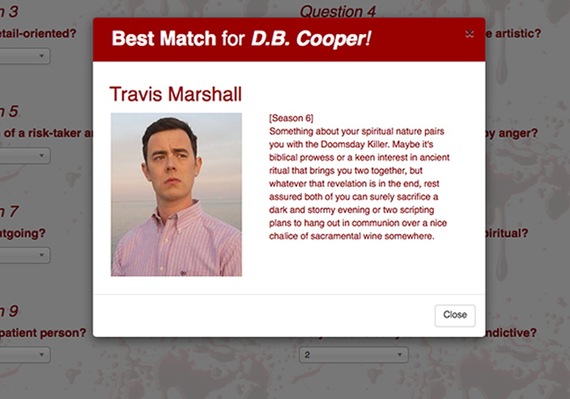

# FriendFinder

Published site: [https://dexter-friend-finder.herokuapp.com/](https://dexter-friend-finder.herokuapp.com/)

## Overview

In this activity, a full-stack (two-page) web site was created as a compatibility-based "FriendFinder" application; essentially, a rudimentary dating app. The concept is to take in results input by a user into a simple survey and then compare those answers with profiles *(previously pre-populated by the author)* from "other" users. The result of that comparison will yield a modal containing the name, picture, and a brief introduction of the overall match based on the user's survey choices. 

Express is used to handle routing, so this necessitated deployment to Heroku in order to allow users to access it in a live environment and complete the questionnaire portion. This survey has 10 questions - each on a scale of 1 to 5 - that relate to personality traits in order to determine the degree of compatibility with specific 'friends' currently stored as an array of objects in the `friends.js` file.

In the interest of basing this exercise in the concept of a theme - for an added twist - I chose one of my favorite television series, Dexter; a show which ran on the Showtime cable network in original production for eight seasons from 2006 to 2013. The "friends" that the app's user can be matched with are either: the primary *antagonist* (mostly serial killers) from each season, someone within Dexter's inner circle, or even the show's main character, Dexter, himself.


- - -

### Behind the Scenes of the App:

#### File Structure

```
.
├── app
│   ├── data
│   │   └── friends.js
│   │	
│   ├── public
│   │   ├── css
│   │   │   └── local_styles.css
│   │   │
│   │   ├── images
│   │   │   └── (multiple images used in home and survey pages)
│   │   │	
│   │   ├── home.html
│   │   └── survey.html
│   │
│   └── routing
│       ├── apiRoutes.js
│       └── htmlRoutes.js
│
├── assets
│   └── images
│       └── (multiple images used in modal)
│
├── node_modules
│   └── (multiple module directories)
│
├── package-lock.json
│ 
├── package.json
│
├── screenshots
│   └── (multiple images used in this README)
│
└── server.js

```

#### File and directory functionality of note:

* Required npm packages, **express**, **body-parser**, and **path** are called by *`server.js`*.


* The **`htmlRoutes.js`** file contains the following routes:

   * There is a **GET** route to `/survey` that calls and renders the 'survey' page.

   * As well, there is a **default** (catch-all) route that leads to `home.html` (which displays the 'home' page).


   ```
	module.exports = function(app) {

	  app.get("/survey", function(req, res) {
	    res.sendFile(path.join(__dirname, "../public/survey.html"));
	  });

	  app.get("/images/Favicon.ico", function(req, res) {
	    res.sendFile(path.join(__dirname, req.url));
	  });

	  // If no matching route is found default to home
	  app.get("*", function(req, res) {
	    res.sendFile(path.join(__dirname, "../public/home.html"));
	  });

	};
   ```

* The **`apiRoutes.js`** file contains the following two routes:

   * A **GET** route with the url `/api/friends` that is used to call a JSON object of all possible friends.


   ```
   app.get("/api/friends", function(req, res) {
      res.json(friendData);
  });
  ```

   * A **POST** route `/api/friends` that is used to handle *incoming survey results*. This POST route *also* handles the compatibility logic embedded in the JSON data.


   ```
   app.post("/api/friends", function(req, res) {
	var userScores = [];
	for (i=0; i<req.body.scores.length; i++){
		userScores.push(parseInt(req.body.scores[i])); // since array members came in a string, I gotta convert!
	}
	var bff;
	var smallestDiff = 9999; // ridiculously large number to use for comparison
	for (i=0; i<friendData.length; i++){
		var friendScores = friendData[i].scores;
		var totalDifference = 0;
		for (j=0; j<userScores.length; j++) {
			totalDifference += Math.abs(userScores[j]-friendScores[j]);
		}
		if (totalDifference<smallestDiff){ // keep comparing numbers based on smallest until you have run through all of the members in the friendData array
			bff = friendData[i];
			smallestDiff = totalDifference;
		}
	}
	res.json(bff);
  });
  ```

* The application's data inside of `app/data/friends.js` was saved as an array of objects. Each of these objects follows the format below: 

```
{
  "name":"Hannah McKay",
  "photo":"http://foo.com/dexter_images/Hannah_McKay.png",
  "scores":[
    	2, 
    	4, 
    	4, 
    	1, 
    	4, 
    	2, 
    	0, 
    	0, 
    	5, 
    	4
	],
  "bio":"You will find yourself intrigued with your intoxicatingly toxic florist BFF; wanting to spend lots of quality time together reminiscing about..."
}

```


#### Compatibility Logic

Each user's results are converted into a simple array of numbers (ex: [5, 1, 4, 4, 5, 1, 2, 5, 4, 1]).

With that array, the difference between current user's scores is compared against those from other users (the pre-populated 'friends'), question by question. Those differences (in absolute values) are added up to calculate the totalDifference.

Example:

```
		User 1: [5, 1, 4, 4, 5, 1, 2, 5, 4, 1]
		User 2: [3, 2, 6, 4, 5, 1, 2, 5, 4, 1]
		(Total Difference: 2 + 1 + 2 = 5)
```

The *closest* match will be the user with the **least** amount of difference.


#### Resulting modal display:

Once the compatibility logic has been processed, a pop-up window (modal) is called to display the most compatible friend resulting from the user's survey results. *Example:*



This modal displays both the name and picture of the closest match, as well as a short bio of the character which is intended to verify the personality compatibility with the user!


- - -

### In case you're interested...

Again, you can interact with this application in real-time at the following address:
[https://dexter-friend-finder.herokuapp.com/](https://dexter-friend-finder.herokuapp.com/), however, if you'd prefer to kick the tires on your local machine, keep reading.


#### Local Environment Setup

To use this version of "FriendFinder" from your own local environment, here's what you've got to do:

**Step 1 - Clone this repo in the command line below using the following text:**
```
git clone https://github.com/bonnieho/FriendFinder.git
```
**Step 2 - In you local directory structure, navigate into the newly cloned repo directory:**
```
cd FriendFinder
```
**Step 3 - Install the required NPM packages using the following command:**
```
npm install
```
**Step 4 - Start the application server using the following command:**
```
node server.js
```

- - -

#### Author's note:

This was one the the exercises originally assigned and completed in my full-stack coding bootcamp. Although the functionality of this app was successfully in place at the time of the assignment's submission, considering the limited amount of time that was available to each topic in this course, it had always been my intention to re-visit this offering to give it the spit-and-polish I felt it was worthy of. So with new blood splatters and updated friend bios, here is that result!

- - - 


(c)2017-2019 __Bonnie Lynne Hoffman__ 

*toward the completion of The University of Texas at Austin Houston Coding Boot Camp Certificate - (June 2017 cohort)*

